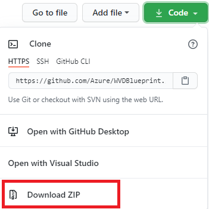

# Instructions for customizing Azure Windows Virtual Desktop to your environment, utilizing Azure Blueprints  

[Azure Blueprints](https://docs.microsoft.com/en-us/azure/governance/blueprints/overview) provide a structured approach to standing up new environments, while adhering to environment requirements.  Microsoft has created a set of Windows Virtual Desktop (WVD) Blueprint objects that help automate the creation of an entire environment, ready to run.  
  
Azure Blueprints utilize ["artifacts"](https://docs.microsoft.com/en-us/azure/governance/blueprints/overview#blueprint-definition), such as:

* Role Assignments
* Policy Assignments
* Azure Resource Manager (ARM) templates
* Resource Groups

The WVD Blueprints are meant to deploy an entire environment, including Azure Active Directory Domain Services (AAD DS), a management virtual machine (VM), networking, WVD infrastructure, and related resources, in a turn-key fashion.   The following is a guide to help accomplish customizing to your environment.

## Recommended Reading

1) [Azure Blueprints] (<https://docs.microsoft.com/en-us/azure/governance/blueprints/overview>)
2) [Windows Virtual Desktop] (<https://docs.microsoft.com/en-us/azure/virtual-desktop/>)

## Prerequisites

1. Two “identities” are required to successfully assign (deploy) the Azure WVD Blueprints:  
    * An [Azure Global Administrator](https://docs.microsoft.com/en-us/azure/active-directory/roles/permissions-reference).  
    > The Azure Global Administrator is a person that has complete permission to an Azure subscription. This is required because modifications will be made at the directory and subscription levels.

    * An [Azure Managed Identity](https://docs.microsoft.com/en-us/azure/active-directory/managed-identities-azure-resources/overview)  
    > The Azure Managed Identity exists within Azure and can securely store and retrieve credentials from Azure Key Vault during the deployment.  

2. An [Azure subscription](https://azure.microsoft.com/en-us/free/) with sufficient credits to deploy the environment, and keep it running at the desired levels.  

3. A development environment can be used to help work with the Blueprint code, as well as [“import”](https://docs.microsoft.com/en-us/azure/governance/blueprints/how-to/import-export-ps) and [“assign”](https://docs.microsoft.com/en-us/azure/governance/blueprints/how-to/manage-assignments-ps) the Blueprints.  
   PowerShell can be utilized with the [Az.Blueprint module](https://docs.microsoft.com/en-us/azure/governance/blueprints/how-to/manage-assignments-ps#add-the-azblueprint-module) for PowerShell.  

    If you've not used Azure Blueprints before, register the resource provider through Azure PowerShell with this PowerShell command:  

    `Register-AzResourceProvider -ProviderNamespace Microsoft.Blueprint`

4. Open an instance of PowerShell, connect to your Azure account, then register the Azure AD provider to your account (if not already registered):

    * `Connect-AzAccount`  
    * `Register-AzResourceProvider -ProviderNamespace Microsoft.AAD`

5. Create the Domain Controller Services service principal (if it does not already exist), with this PowerShell command

    `New-AzureADServicePrincipal -AppId "2565bd9d-da50-47d4-8b85-4c97f669dc36"`

    (more info on this topic) <https://docs.microsoft.com/en-us/azure/active-directory/develop/howto-create-service-principal-portal>

6. Create a user-assigned managed identity within Azure, which will later be used to execute the blueprint.  Note that in the case of “greenfield” deployments, the level of assignment will need to be the Azure subscription.  The Blueprint creates objects at the subscription level during the blueprint deployment.

    * Create an Azure security group (example: ‘Blueprint Operators’)  
    * Add the managed identity to the Azure security group created in the previous step  
    * Assign permissions to the group, to allow members to create objects at the subscription level  
    * At the subscription level, assign roles to the group previously created, by going to the following location in the Azure Portal  
       > **Azure Portal** -> **Home** -> **Subscriptions** -> (***your subscription***) -> **Access Control (IAM)**

7. Click **Add Role Assignments**, then add the following role assignments to the group you created earlier (step 6):

    * [Blueprint Contributor](https://docs.microsoft.com/en-us/azure/role-based-access-control/built-in-roles#blueprint-contributor)
    * [Blueprint Operator](https://docs.microsoft.com/en-us/azure/role-based-access-control/built-in-roles#blueprint-operator)
    * [Managed Identity Operator](https://docs.microsoft.com/en-us/azure/role-based-access-control/built-in-roles#managed-identity-operator)

8. The managed identity must be assigned the **Owner** role at the subscription level.  The reason is that the managed identity needs full access during the deployment, for example to initiate the creation of an instance of Azure AD DS.  

        **MORE INFO:** https://docs.microsoft.com/en-us/azure/cost-management-billing/manage/add-change-subscription-administrator  

9. Add the managed identity to the Global Administrators group in Azure AD.  The managed identity is going to be initiating the creation of users and virtual machines during the blueprint process.

        **MORE INFO:** https://docs.microsoft.com/en-us/azure/governance/blueprints/how-to/configure-for-blueprint-operator  

10.  The Blueprint main file, and related artifact objects. These objects are publically available on Github.com. Once the Blueprint objects have been acquired, they need to be customized to each respective environment. The necessary customizations can be applied in a few different ways.

         

### Blueprint Objects and Purpose

| Type | Object | Purpose |
|-|-|-|  
|Assignment file|assign_default.json|Hard-code and pass to the Blueprint, the environment specific items such as subscription, UserAssignedIdentity, etc.|  
|Blueprint file|Blueprint.json|The is the central file of an Azure Blueprint definition|
|Artifact|adds.json|directs the creation of Azure Active Directory Domain Services resources|
|Artifact|addsDAUser.json|directs the creation of domain administrator account|
|Artifact|DNSsharedsvcs.json|directs the creation of domain name services (DNS) resources|
|Artifact|keyvault.json|directs the creation of Azure Key Vault resources, used to store and retrieve credentials used at various points during the Blueprint assignment|
|Artifact|log-analytics.json|Sets up logging of various components to Azure storage|
|Artifact|MGMTVM.json|Sets up logging of various components to Azure storage|
|Artifact|net.json|Sets up networking and various subnets|
|Artifact|nsg.json|Sets up network security groups|
|Artifact|wvdDeploy.json|Deploys WVD session hosts, created the WVD host pool and application group, and adds the session hosts to the application group|
|Artifact|wvdTestUsers.json|Creates users in AAD DS, that are available to log in after the deployment is complete|

## Blueprint Parameters
Blueprint parameters allow you to configure the deployment and customize the environment.


### Required Parameters
The blueprint includes the following required parameters.  

| Parameter | Example Value | Purpose |  
|-|-|-|  
|**ADDS_domainName**|wvdbp.contoso.com|The domainname for the Azure ADDS domain that will be created|
|**script_executionUserResourceID**|Resource ID Path|Resource ID for the Managed Identity that will execute embedded deployment scripts.|
|**script_executionUserObjectID**|xxxxxxxx-xxxx-xxxx-xxxx-xxxxxxxxxxxx|Object ID for the Managed Identity that will execute embedded deployment scripts.|
|**keyvault_ownerUserObjectID**|xxxxxxxx-xxxx-xxxx-xxxx-xxxxxxxxxxxx|Object ID of the user that will get access to the Key Vault. To retrieve this value go to Microsoft Azure Portal > Azure Active Directory > Users > (user) and copy the User’s Object ID.|

### Optional Parameters
These optional parameters either have default values or, by default, do not have values. You can override them during the blueprint assigment process.

| Parameter | Default Value | Purpose |
|-|-|-|
|**resourcePrefix**|WVD|A text string prefixed to the begining of each resource name.|
|**ADDS_emailNotifications**|wvdbpadmin@contoso.com|An email account that will receive ADDS notifications|
|**_ScriptURI**|https://raw.githubusercontent.com/Azure/WVDBlueprint/main/scripts|URI where Powershell scripts executed by the blueprint are located.|
|**log-analytics_service-tier**|PerNode|Log Analytics Service tier: Free, Standalone, PerNode or PerGB2018.|
|**log-analytics_data-retention**|365|Number of days data will be retained.|
|**nsg_logs-retention-in-days**|365|Number of days nsg logs will be retained.|
|**vnet_vnet-address-prefix**|10.0.0.0/16|Address prefix of the vnet created by the WVD Blueprint.|
|**vnet_enable-ddos-protection**|true|Determines whether or not DDoS Protection is enabled in the Virtual Network.|
|**vnet_sharedsvcs-subnet-address-prefix**|10.0.0.0/24|Shared services subnet address prefix.|
|**vnet_adds-subnet-address-prefix**|10.0.6.0/24|Subnet for Azure ADDS.|
|**vnet_logs-retention-in-days**|365|Number of days vnet logs will be retained.|
|**keyvault_logs-retention-in-days**|365|Number of days keyvault logs will be retained.|
|**DAUser_adminuser**|domainadmin@{ADDS_domainName}|This account will be a member of AAD DC Administrators and Local Admin on deployed VMs.|
|**wvdHostpool_hostpoolname**|{resourcePrefix}-wvd-hp||
|**wvdHostpool_workspaceName**|{resourcePrefix}-wvd-ws||
|**wvdHostpool_hostpoolDescription**|||
|**wvdHostpool_vmNamePrefix**|{resourcePrefix}vm|Prefix added to each WVD session host name.|
|**wvdHostpool_vmGalleryImageOffer**|office-365||
|**wvdHostpool_vmGalleryImagePublisher**|MicrosoftWindowsDesktop||
|**wvdHostpool_vmGalleryImageSKU**|20h1-evd-o365pp||
|**wvdHostpool_vmImageType**|Gallery||
|**wvdHostpool_vmDiskType**|StandardSSD_LRS||
|**wvdHostpool_vmUseManagedDisks**|true||
|**wvdHostpool_allApplicationGroupReferences**|||
|**wvdHostpool_vmImageVhdUri**||(Required when vmImageType = CustomVHD) URI of the sysprepped image vhd file to be used to create the session host VMs.|
|**wvdHostpool_vmCustomImageSourceId**||(Required when vmImageType = CustomImage) Resource ID of the image.|
|**wvdHostpool_networkSecurityGroupId**||The resource id of an existing network security group.|
|**wvdHostpool_personalDesktopAssignmentType**|||
|**wvdHostpool_customRdpProperty**||Hostpool rdp properties.|
|**wvdHostpool_deploymentId**|||
|**wvdHostpool_ouPath**|||
|**wvdUsers_userPrefix**|user|Username prefix. A number will be added to the end of this value.|
|**wvdUsers_userCount**|10|Total Number of WVD users to create.|

## Import, Publish and Assign the Blueprint

1. Import the Blueprint - <https://docs.microsoft.com/en-us/azure/governance/blueprints/how-to/import-export-ps>\
2. Publish the Blueprint - <https://docs.microsoft.com/en-us/azure/governance/blueprints/create-blueprint-portal>
3. Assign the Blueprint - <https://docs.microsoft.com/en-us/azure/governance/blueprints/create-blueprint-portal>

**NOTE:** The following two sections are two methods available to assign the WVD Blueprint.  You can select one or the other, you do not have to do both.

### Manage the Blueprint using Azure Cloud Shell
Azure hosts Azure Cloud Shell, an interactive shell environment that can be used through a web browser.
You can use either Bash or PowerShell with Cloud Shell to work with Azure services.
You can use the Cloud Shell preinstalled commands to import and assign the WVD Blueprint without having to install anything on your local environment.  
There are several ways to get started with Azure Cloud Shell:  

1. Start Azure CloudShell:  

    - **Direct link**: Open a browser to [https://shell.azure.com](https://shell.azure.com).

    - **Azure portal**: Select the Cloud Shell icon on the [Azure portal](https://portal.azure.com):

      

2. Start PowerShell in Azure CloudShell ([more information here](https://docs.microsoft.com/en-us/azure/cloud-shell/overview#choice-of-preferred-shell-experience))

3. Run the following command to clone the Azure WVDBlueprint repository to CloudDrive.

    ```azurepowershell-interactive
    git clone https://github.com/Azure/WVDBlueprint.git $HOME/clouddrive/WVDBlueprint
    ```
    >**TIP:**  Run ```dir $HOME/clouddrive``` to verify the repository was successfully cloned to your CloudDrive

4. Run the following commands to import the required PowerShell modules needed to import the blueprint (if not previously installed)

    ```PowerShell
    Install-Module -Name Az.Blueprint
    Import-Module Az.Blueprint
    ```

5. Run the following command to import the WVD Blueprint definition, and save it within the specified subscription or management group.
    ```powershell
    Import-AzBlueprintWithArtifact -Name "YourBlueprintName" -SubscriptionId "00000000-1111-0000-1111-000000000000" -InputPath "$HOME/clouddrive/WVDBlueprint/blueprint"
    ```
    >**NOTE:** The '-InputPath' argument must point to the folder where blueprint.json file is placed.

6. From the Azure Portal, browse to [Azure Blueprint service tab](https://portal.azure.com/#blade/Microsoft_Azure_Policy/BlueprintsMenuBlade/GetStarted) and select "**Blueprint definitions**".  
You can review newly imported Blueprint definitions and follow instructions to edit, publish and assign blueprint. ([More information](https://docs.microsoft.com/en-us/azure/governance/blueprints/create-blueprint-portal#edit-a-blueprint))  

### Manage the Blueprint using local storage on a device (Windows instructions)  

You can manage the WVD Blueprint using a device that has a small amount of local storage available.

1. Go the [WVD Blueprint Github repository main folder](https://github.com/Azure/WVDBlueprint).  

2. Click or tap the down arrow on the green button called 'Code', then tap or click the option 'Download Zip'.  

        

3. Once the .zip file is downloaded to your local device, you can expand the contents to any location of your choosing,
by double-clicking the downloaded .zip file, and then copying the main folder within the zip to any location, such as 'C:\WVDBlueprint-main'.  

4. The next is to import the Blueprint to your Azure subscription.  There are the high-level steps to import the Blueprint:

    1. Start PowerShell.
    2. Run the following PowerShell commands to import the required modules needed to import the blueprint (if not previously installed)

    ```PowerShell
    Install-Module -Name Az.Blueprint
    Import-Module Az.Blueprint
    ```
    >**NOTE:** Installing the PowerShell 'Az' modules does not include the Az.Blueprint modules. If you have installed the 'Az' modules, you will still need to install the Az.Blueprint modules.  

    3. Authenticate to your subscription by using the following PowerShell command

    ```powershell
    Connect-AzAccount
    ```

    4. Run the following command to import the Blueprint to your Azure subscription:  

    ```powershell    
    Import-AzBlueprintWithArtifact -Name "YourBlueprintName" -SubscriptionId "00000000-1111-0000-1111-000000000000" -InputPath 'C:\WVDBlueprint-main\Blueprint'
    ```

6. From the Azure Portal, browse to [Azure Blueprint service tab](https://portal.azure.com/#blade/Microsoft_Azure_Policy/BlueprintsMenuBlade/GetStarted) and select "**Blueprint definitions**".  
You can review newly imported Blueprint definitions and follow instructions to edit, publish and assign blueprint. ([More information](https://docs.microsoft.com/en-us/azure/governance/blueprints/create-blueprint-portal#edit-a-blueprint))  

## Teardown

If an environment built by this blueprint is no longer needed, a script is provided in the Resources folder that will export logs found in a WVD Blueprint deployment's Log Analytics Workspace to a csv file stored in the directory specified at runtime.  

The script finds and removes the following items that were previously deployed via WVD Blueprint:

* All SessionHosts and HostPools in a ResourceGroup based on resource prefix
* All users discovered in 'WVD Users' group
* 'WVD Users' group itself
* 'AAD DC Admins' group

Use of `-verbose`, `-whatif` or `-comfirm` ARE supported. Also, the script will create one Powershell Job for each Resource Group being removed. Teardowns typically take quite some time, so this will allow you to return to prompt and keep working while the job runs in the background.  

**Example:**

```powershell
#Exports logs of a WVD Blueprint deployment that used the prefix "ABC" followed by a removal:
.\Remove-AzWvdBpDeployment.ps1 -Verbose -Prefix "ABC" -LogPath "C:\projects"

#Use help for more details or examples:  
help .\Remove-AzWvdBpDeployment.ps1
```

## Tips

* [Visual Studio Code](https://code.visualstudio.com/) is a Microsoft provided suite available for editing, importing, and assigning the Blueprints. If using VS Code, the following extensions will greatly assist the efforts:|

  * Azure Resource Manager Tools  
  * XML Formatter  
  * PowerShell extension (so that all work can be performed within one tool)  

   There may be other extensions available that perform the same functionality

* To store scripts and any other objects needed during Blueprint assignment on Internet connected assigments, a publically web location can be used to store scripts and other objects needed during Blueprint assigment.  
[Azure Storage Blob](https://azure.microsoft.com/en-us/services/storage/blobs/) is one possible method to make the scripts and other objects available.
Whatever method chosed, the access method should be "public" and "anonymous" read-only access.

* If you need to delete a deployment with the intent of starting over with a new deployment, you will need to change the "Deployment Prefix" value in the "assign_default.json" file.
  This file is used to prefix most of the Azure resources created during the deployment, including an [Key Vault](https://azure.microsoft.com/en-us/services/key-vault/) object.
  Azure Key Vault is used to store and retrieve cryptogrphic keys used by cloud apps and services, and as such is treated with great care in Azure.
  When an Azure Key Vault is deleted, it transitions to a "soft delete" state for a period of time, before actually being deleted.
  While an Azure Key Vault is in soft delete state, another key vault cannot be created with the same name.  Therefore, if you do not change your
  Resource Prefix value for subsequent deployments, the subsequent deployments will fail with an error referencing Key Vault name.

## Trademarks

This project may contain trademarks or logos for projects, products, or services. Authorized use of Microsoft trademarks or logos is subject to and must follow  [Microsoft's Trademark & Brand Guidelines](https://www.microsoft.com/en-us/legal/intellectualproperty/trademarks/usage/general) . Use of Microsoft trademarks or logos in modified versions of this project must not cause confusion or imply Microsoft sponsorship. Any use of third-party trademarks or logos are subject to those third-party's policies.
