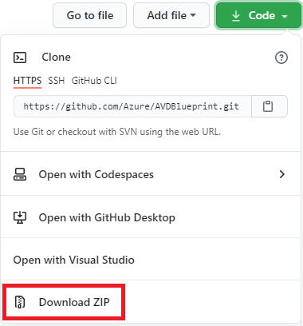

# Instructions for customizing and deploying Azure Virtual Desktop to your environment, utilizing Azure Blueprints  

## Overview

[Azure Blueprints](https://docs.microsoft.com/en-us/azure/governance/blueprints/overview) provide a structured approach to standing up new environments, while adhering to environment requirements.  Microsoft has created a set of Azure Virtual Desktop (AVD) Blueprint objects that help automate the creation of an entire environment, ready to run.  
Azure Blueprints utilize ["artifacts"](https://docs.microsoft.com/en-us/azure/governance/blueprints/overview#blueprint-definition), such as:

* Role Assignments
* Policy Assignments
* Azure Resource Manager (ARM) templates
* Resource Groups

The AVD Blueprints are meant to deploy an entire environment, including Azure Active Directory Domain Services (AAD DS), a management virtual machine (VM), networking, AVD infrastructure, and related resources, in a turn-key fashion.   The following is a guide to help accomplish customizing to your environment.  

## High Level steps to get started

* **Configure pre-requisites** in your Azure subscription.
* **Download all Blueprint files locally** to a folder on your device, such as example: **'C:\VSCode'**.
* **Edit the included sample files** to customize to your environment.
* **Import the Blueprint to your Azure subscription.** The easiest and fastest way to add this Blueprint definition is by using the sample file **import-bp.ps1**.
* **Publish the Blueprint** (This can be done automatically with the included sample file **import-bp.ps1**).

> [!NOTE]
> The included sample file **import-bp.ps1** accomplishes the import and publishing steps in one script.

* **Assign the Blueprint**, which is the process of "assigning" a published Blueprint definition version to your subscription, and which initiates the Blueprint deployment.

## Prerequisites

* **An [Azure tenant](https://docs.microsoft.com/en-us/microsoft-365/education/deploy/intro-azure-active-directory#what-is-an-azure-ad-tenant)**. Though you can create a long tenant domain name prefix, you cannot in AAD DS.  Therefore it is recommended to have your domain name prefix 15 characters or less.  

> [!IMPORTANT]
> It is not currently possible to create a managed domain name with a prefix that exceeds 15 characters.  More information can be found on this topic, in this article:  
<https://docs.microsoft.com/en-us/azure/active-directory-domain-services/tutorial-create-instance>

* **An [Azure subscription](https://azure.microsoft.com/en-us/free/) with sufficient credits to deploy the environment, and keep it running at the desired levels**

* **An [Azure Global Administrator](https://docs.microsoft.com/en-us/azure/active-directory/roles/permissions-reference) account**  
  * An Azure account with Azure Active Directory Global administrator role assigned.
  * This same Azure account needs the **'Owner' role** assigned at the Azure subscription level.

* **An [Azure Managed Identity](https://docs.microsoft.com/en-us/azure/active-directory/managed-identities-azure-resources/overview)**  
The Azure Managed Identity exists within Azure and can securely store and retrieve credentials from Azure Key Vault during the deployment.  This AVD Blueprint utilizes type 'User Assigned Managed Identity'.  The instructions for creating a managed identity are here: **[Create a user-assigned managed identity](https://docs.microsoft.com/en-us/azure/active-directory/managed-identities-azure-resources/how-to-manage-ua-identity-portal#create-a-user-assigned-managed-identity)**

> [!NOTE]
> In the case of deploying to an otherwise empty subscription, the level of assignment will need to be the Azure subscription.  The AVD Blueprint, by default, creates objects at the subscription level during the blueprint deployment such as Azure AD DS.

* **Security configuration in the environment for a Blueprint Operator**  
The management of Blueprint definitions and Blueprint assignments are two different roles, thus the need for two different identities (Azure administrator and managed identity). The security group being granted the **Blueprint Operator** role needs to also be granted the **Managed Identity Operator** role. Without this permission, blueprint assignments fail because of lack of permissions.  One method is to add the two identities to the one security group (example *Blueprint Operators*), and then you only need add the required roles to the security group.

    The steps to create a security group and assign the roles are as follows (documentation [here](https://docs.microsoft.com/en-us/azure/governance/blueprints/how-to/configure-for-blueprint-operator)):  

  * [Create an Azure security group](https://docs.microsoft.com/en-us/azure/active-directory/fundamentals/active-directory-groups-create-azure-portal) (example: **Blueprint Operators**)  
  * At the subscription level, assign roles to the group previously created, by going to the following location in the Azure Portal  
  > **Azure Portal** -> **Home** -> **Subscriptions** -> (***your subscription***) -> **Access Control (IAM)**  
  * [Add the managed identity created earlier in this section, and the Global Administrator accounts to the Azure security group](https://docs.microsoft.com/en-us/azure/active-directory/fundamentals/active-directory-groups-create-azure-portal#create-a-basic-group-and-add-members)  
  * Assign permissions to the group , to allow members to create objects at the subscription level:

    * [Blueprint Contributor](https://docs.microsoft.com/en-us/azure/role-based-access-control/built-in-roles#blueprint-contributor)
    * [Blueprint Operator](https://docs.microsoft.com/en-us/azure/role-based-access-control/built-in-roles#blueprint-operator)
    * [Managed Identity Operator](https://docs.microsoft.com/en-us/azure/role-based-access-control/built-in-roles#managed-identity-operator)  

    When correctly configured, the Role assignments for your Azure AD group, should look like this:  

    

* **Azure Blueprint resource provider registered to your subscription** through Azure PowerShell with this PowerShell command:  

    ```powershell
    Register-AzResourceProvider -ProviderNamespace Microsoft.Blueprint
    ```

    You should receive this output from the Register-AzResourceProvider command:  

    ```powershell
    ProviderNamespace   Microsoft.Blueprint
    RegistrationState : Registering
    ResourceTypes     : {blueprints, blueprints/artifacts, blueprints/versions, blueprints/versions/artifacts…}
    Locations         : {}
    ```

* **Azure Active Directory provider registered to your subscription** (if not already registered):  
Check the current provider registration status in your subscription:  

    ```powershell
    Get-AzResourceProvider -ListAvailable | Select-Object ProviderNamespace, RegistrationState
    ```

    If necessary, register the Azure AD resource provider:

    ```PowerShell
    Register-AzResourceProvider -ProviderNamespace Microsoft.AAD
    ```

* **Azure Active Directory Domain Services Enterprise application registered to your subscription**

    Documentation: [Create an Azure Active Directory Domain Services managed domain using an Azure Resource Manager template](https://docs.microsoft.com/en-us/azure/active-directory-domain-services/template-create-instance)

    Run the following PowerShell command:

    ```PowerShell
    New-AzureADServicePrincipal -AppId "6ba9a5d4-8456-4118-b521-9c5ca10cdf84"
    ```

* **[Domain Controller Services service principal](https://docs.microsoft.com/en-us/azure/active-directory/develop/howto-create-service-principal-portal)** (if it does not already exist), with this PowerShell command

    ```PowerShell
    New-AzureADServicePrincipal -AppId "2565bd9d-da50-47d4-8b85-4c97f669dc36"
    ```  

* **Managed identity assigned the Owner role at the subscription level**  
The reason is that the managed identity needs full access during the deployment, for example to initiate the creation of an instance of Azure AD DS.  

    **MORE INFO:** [Add or change Azure subscription administrators](https://docs.microsoft.com/en-us/azure/cost-management-billing/manage/add-change-subscription-administrator)  

* **The account used to assign the Blueprint, granted "User Access Administrator" at the subscription level**  
The account used to manage the subscription and later assign the Blueprint, should be assigned the "User Access Administrator". During Blueprint assignment users are going to be created and assigned to a AVD group. The "User Access Administrator" permission ensures the requisite permission in Azure AD to perform this function.  

    **MORE INFO:** [Assign a user as an administrator of an Azure subscription](https://docs.microsoft.com/en-us/azure/role-based-access-control/role-assignments-portal-subscription-admin)  

* **The Blueprint main file (Blueprint.json), and related artifact objects**  
These objects are publicly available on Github.com. Once the Blueprint objects have been acquired, they need to be customized to each respective environment.

## Managing and Assigning/Deploying the AVD Blueprint

> [!NOTE]
> The following sub-sections are example methods available to assign the AVD Blueprint.  There are sample assignment files in the Github repository in the 'Examples & Samples' folder.

### Manage and Deploy the AVD Blueprint using a local repository of Blueprint files and customized files to import and assign using PowerShell (Windows device)

This method performs all activities on the local machine.  This example uses Visual Studio Code as the tool to edit, save, connect to Azure, and deploy.  Several extensions make working with ARM templates a little easier:

* Install Visual Studio Code (the following extensions are recommended):
  * GitLens--Git supercharged
  * PowerShell
  * Azure CLI Tools
  * Azure Resource Manager (ARM) Tools

* Go the [AVD Blueprint Github repository main folder](https://github.com/Azure/AVDBlueprint) in your favorite web browser

* Click or tap the down arrow on the green button called **'Code'**, then tap or click the option 'Download Zip'.

    

* Once the .zip file is downloaded to your local device, you can expand the contents to any location of your choosing, by double-clicking the downloaded .zip file, and then copying the main folder within the zip to any location.
The example files in this repository use this path:

    > C:\VSCode\AVDBlueprint  
    > C:\VSCode\AVDBlueprint\Blueprint  
    > C:\VSCode\AVDBlueprint\Blueprint\Artifacts  
    > C:\VSCode\AVDBlueprint\Blueprint\Examples and Samples  
    > C:\VSCode\AVDBlueprint\Blueprint\images  
    > C:\VSCode\AVDBlueprint\Blueprint\scripts  
    > C:\VSCode\AVDBlueprint_CustomizedFiles <-- This folder at same level of Blueprint repository in case you want to delete and unzip new or Git clone.

  > [!TIP]
  > If you use the folder structure above, copy the files from folder **'Examples and Scripts'** to the folder **'AVDBlueprint_CustomizedFiles'**.  Then customize your files so you won't have to customize them again, or at least maybe not all the way from scratch.

* Customize the following files from the **'Examples and Samples'** folder.

  1. Create a folder, for example 'C:\VSCode\AVDBlueprint_CustomizedFiles'.
  1. Copy the files from 'C:\VSCode\AVDBlueprint\Blueprint\Examples and Samples' to 'C:\VSCode\AVDBlueprint_CustomizedFiles'
  1. Edit the file **'run.config.json'**
      1. Change the **'TenantID'** value to your [Azure Tenant ID](https://docs.microsoft.com/en-us/azure/active-directory/fundamentals/active-directory-how-to-find-tenant)
      1. Change the **'subscriptionID'** value to your [Azure Subscription ID](https://docs.microsoft.com/en-us/azure/media-services/latest/setup-azure-subscription-how-to?tabs=portal)
      1. If desired, change the **'blueprintName'** value (you can use the sample name)
      1. If desired, change the **'blueprintPath'** path value (you can use the sample directory names and structure)
      1. If desired, change the **'assignmentFile'** path value (you can use the sample directory names and structure)
  1. Edit the file **'import-bp.json'** to point to file *'run.config.json'*.
      1. If you are using the sample folder structure, this file does not need to be edited.
      1. If you are using a folder structure with different paths and names, edit line 1 argument, so the path resolves to the file 'run.config.json'.
  1. Edit the file **'assign-bp.json'** to point to file *'run.config.json'*.
      1. If you are using the sample folder structure, this file does not need to be edited.
      1. If you are using a folder structure with different paths and names, edit line 1 argument, so the path resolves to the file 'run.config.json'.
  1. Edit the file **'assign_default.json'**
      1. Change the two **'Location'** parameters to point to the Azure location you are deploying to.  You can log in to your Azure tenant using PowerShell, or Azure Cloud Shell, and run the command **'Get-AzLocation | ft location'**.
      1. Change the parameter value **'userAssignedIdentities'** to the path to your user-assigned managed identity.  The easiest way to get this value is the following:
          1. In the Azure portal, start typing 'Managed Identities', and in the results list, click **'Managed Identities'**
          1. Click the name of your managed identity
          1. In the **'Settings'** section/blade, click **'Properties'**
          1. Copy the value of **'Resource ID'**, then paste that into the **'userAssignedIdentities'** parameter value
      1. In the **'Properties'** section of the 'assign_default.json':
          1. Edit the value of the **'BlueprintID'**, and replace the sample Azure subscription ID (between the second and third '/' characters from the left) with your subscription ID.
          1. Edit the value of the **'scope'**, and replace the sample Azure subscription ID  (between the second and third '/' characters from the left) with your subscription ID.
      1. The following parameter values are in the  **'Parameters'** section of the **'assign_default.json'**
          1. The following parameter values are ***required*** to be changed, to your Azure environment values.
              1. **'ADDS_domainName'**: The name of the Azure Active Directory Directory Services instance that will be created and synced to your Azure AD tenant.
              1. **'ADDS_emailNotifications'**: Not currently implemented, but should be changed to a local admin e-mail account.
              1. **'script_executionUserResourceID'**: ARM path to the managed identity by name.  Get this in the Azure portal, Managed Identities, Identity, Properties, **'Resource ID'**.
              1. **'script_executionUserObjectID'**: The GUID/object ID of the Azure global administrator account used to initiate the Blueprint assignment.  You can get this in Azure AD, Users, username, then **'Object ID'** (under Identities)
              1. **'keyvault_ownerUserObjectID'**: The GUID/object ID of the managed identity used during the Blueprint assignment.  You can get this in Azure Portal, Managed Identities, click identity name, the copy the 'Object ID' in the 'Essentials' section.
          1. The following parameter values are not required, though you may want to edit some of the default values to your environment and/or requirements.
              1. **'_ScriptURI'**: You can leave this to the current default, or if you fork the main repository to a new repository and wish to use that URI, you can.
              1. **'AzureEnvironmentName'**: The current default is 'Azure Cloud' (Azure Commercial).  You can change this value in case you are deploying to *Azure Gov*.
              1. **'AzureStorageFQDN'**: The current default is 'Azure Cloud' (Azure Commercial).  You can change this value in case you are deploying to *Azure Gov*.
              1. **'avdHostPool_vmGalleryImageSKU'**: The version of Windows 10 EVD being deployed.  The 'Allowed Values' list are other available Windows versions from the Azure Gallery.
              1. **'avdHostPool_vmSize'**: The Azure VM size.  You can change this value to any AVD supported VM size in the region you are assigning/deploying to.
              1. **'avdHostPool_vmNumberOfInstances'**: The number of EVD VMs that this Blueprint assignment will create.
              1. **'avdHostPool_maxSessionLimit'**: The maximum number of users that can log in to a Windows EVD session host, in the host pool created by this Blueprint assignment.
              1. **'avdUsers_userCount'**: The number of test users created by this Blueprint assignment.
              1. **'vnet_enable-ddos-protection'**: Controls whether this Blueprint creates an [Azure DDoS plan](https://docs.microsoft.com/en-us/azure/ddos-protection/ddos-protection-overview) or not.

## Teardown

If an environment built by this blueprint is no longer needed, a script is provided in the Resources folder that will export logs found in an AVD Blueprint deployment's Log Analytics Workspace to a csv file stored in the directory specified at runtime.  

The script finds and removes the following items that were previously deployed via AVD Blueprint:

* All SessionHosts and HostPools in a ResourceGroup based on resource prefix
* All users discovered in 'AVD Users' group
* 'AVD Users' group itself
* 'AAD DC Admins' group

Use of `-verbose`, `-whatif` or `-confirm` ARE supported. Also, the script will create one Powershell Job for each Resource Group being removed. Teardowns typically take quite some time, so this will allow you to return to prompt and keep working while the job runs in the background.  

**Example:**

```powershell
#Exports logs of a AVD Blueprint deployment that used the prefix "ABC" followed by a removal:
.\Remove-AzAvdBpDeployment.ps1 -Verbose -Prefix "ABC" -LogPath "C:\projects"

#Use help for more details or examples:  
help .\Remove-AzAvdBpDeployment.ps1
```

## Tips

### Preexisting Active Directory

If there is already an active Active Directory environment in the target environment, it is possible to have this blueprint integrate with that rather than deploy a new one. Two actions need to be taken to support this:

1. Delete the adds.json artifact from the Artifacts folder
2. Remove all "adds" entries from the "dependsOn" section of the following artifacts:
    * addsDAUser.json
    * avdDeploy.json
    * DNSsharedSvcs.json
    * mgmtvm.json

### Group Policy Settings

Regarding Group Policy settings that are applied to the AVD session host computers, during the Blueprint deployment. There are two
sections of Group Policy settings applied to the AVD session hosts:  

* **FSLogix settings**
* **Remote Desktop Session Host redirection settings**  

#### FSLogix Settings

The FSLogix Windows policy settings are the mechanism used to enable the FSLogix profile management solution.  This Blueprint currently utilizes Azure Files as the FSLogix profile container storage location.  These settings are documented in [this article](https://docs.microsoft.com/en-us/fslogix/configure-profile-container-tutorial).

During Blueprint deployment, some of the parameters are evaluated and used to create a variable for the FSLogix profile share UNC path, as it exits in each unique deployment.  The parameter is then written to a new Group Policy Object that is applied to the Active Directory Organizational Unit that is created by the script run from the management VM, for the AVD session host VMs.  Here is the complete list of FSLogix settings applied by this Blueprint:

> VHDLocation == {unique UNC path for each deployment}  
> Enabled == Yes  
> DeleteLocalProfileWhenVHDShouldApply == Enabled  
> FlipFlopProfileDirectoryName == Enabled  

#### Remote Desktop Session Host redirection settings

This Blueprint adds as a default, one RDP redirection setting:

> "fEnableTimeZoneRedirection"  

There are several Windows policy settings that control certain aspects of the user experience while connected to a session host. The **"Remote Desktop Session Host redirection"** settings are set in the script,  **'CreateAADDSFileShare_ConfigureGP.ps1'**.  This script is run from the "management VM" in the "MGMTVM" artifact.  If you wish to add additional redirection settings, the best way may be through current or planned management methods such as Group Policy.

There is one setting that is not available in that file, which is a Group Policy start script entry, for a script that is downloaded and run by each AVD session host, on their next Startup ***after they have received and applied their new group policy***.  Here is the workflow of the chain of events that lead up to the session hosts becoming fully functional.

1. AVD session host VMs are created, and joined to the AAD DS domain.  This happens in the artifact **"AVDDeploy.json"**.
2. Later the "management VM" is created, and joined to the domain.  This domain join triggers a reboot, and the JoinDomain extension waits for the machine to reboot and check in before the "MGMTVM" artifact continues.
3. After the management VM reboots, the next section of "MGMTVM" artifact initiates running a custom script, which is downloaded from the ScriptURI parameter value, to the management VM.
4. The Management VM runs the **'CreateAADDSFileShare_ConfigureGP.ps1'** script, which has two sections: 1) Create storage for FSLogix, 2) Run the domain management code
5. The domain management code does the following for the session hosts:
    1. Creates a new GPO called **"AVD Session Host policy"**
    2. Creates a new OU called **"AVD Computers"**
    3. Links the AVD GPO to the AVD OU
    4. Restores a previous GP export (downloaded via ScriptURI parameter), which imports a policy Startup script to the new GPO Startup folder
    5. Moves only the AVD session host computer objects to the new AVD OU
    6. Invokes a command to each VM in the AVD OU, to immediately refresh Group Policy
    7. Invokes a command to each VM in the AVD OU, to reboot with a 5 second delay
    8. On restart, the AVD VMs will run the Virtual Desktop Optimization Tool available from Github.com.

#### Session Host RDP lockdown settings  

```powershell
Set-GPRegistryValue -Name "AVD Session Host Policy" -Key "HKLM\SOFTWARE\Policies\Microsoft\Windows NT\Terminal Services" -Type DWORD -ValueName "fDisableAudioCapture" -Value 1  
Set-GPRegistryValue -Name "AVD Session Host Policy" -Key "HKLM\SOFTWARE\Policies\Microsoft\Windows NT\Terminal Services" -Type DWORD -ValueName "fDisableCameraRedir" -Value 1  
Set-GPRegistryValue -Name "AVD Session Host Policy" -Key "HKLM\SOFTWARE\Policies\Microsoft\Windows NT\Terminal Services" -Type DWORD -ValueName "fDisableCcm" -Value 1  
Set-GPRegistryValue -Name "AVD Session Host Policy" -Key "HKLM\SOFTWARE\Policies\Microsoft\Windows NT\Terminal Services" -Type DWORD -ValueName "fDisableCdm" -Value 1  
Set-GPRegistryValue -Name "AVD Session Host Policy" -Key "HKLM\SOFTWARE\Policies\Microsoft\Windows NT\Terminal Services" -Type DWORD -ValueName "fDisableClip" -Value 1  
Set-GPRegistryValue -Name "AVD Session Host Policy" -Key "HKLM\SOFTWARE\Policies\Microsoft\Windows NT\Terminal Services" -Type DWORD -ValueName "fDisableLPT" -Value 1  
Set-GPRegistryValue -Name "AVD Session Host Policy" -Key "HKLM\SOFTWARE\Policies\Microsoft\Windows NT\Terminal Services" -Type DWORD -ValueName "fDisablePNPRedir" -Value 1  
Set-GPRegistryValue -Name "AVD Session Host Policy" -Key "HKLM\SOFTWARE\Policies\Microsoft\Windows NT\Terminal Services" -Type DWORD -ValueName "fEnableTimeZoneRedirection" -Value 1
```

The group policy settings come from Microsoft documentation: [Group Policy Settings Reference Spreadsheet for Windows 10 ...](https://www.microsoft.com/en-us/download/101451).

### Development Tools

[Visual Studio Code](https://code.visualstudio.com/) is a Microsoft provided suite available for editing, importing, and assigning the Blueprints. If using VS Code, the following extensions will greatly assist the efforts:|

* Azure Resource Manager Tools  
* XML Formatter  
* PowerShell extension (so that all work can be performed within one tool)  

There may be other extensions available that perform the same or similar functionality.

### Accessing the Blueprint files and scripts

To store scripts and any other objects needed during Blueprint assignment on Internet connected assignments, a public web location can be used to store scripts and other objects needed during Blueprint assignment.  
[Azure Storage Blob](https://azure.microsoft.com/en-us/services/storage/blobs/) is one possible method to make the scripts and other objects available.  
Whatever method chosen, the access method should be "public" and "anonymous" read-only access.  
Another method that could be used to access scripts is a "fork" from the Azure AVD Blueprint repository.  You can fork to your Github repository, then edit the scripts or Blueprint files if needed, then change the parameter "_ScriptURI" to your location.  
For example, I created a fork of the Azure AVD Blueprint repository to my personal repository at "https://github.com/robsmi-msfte/AVDBlueprint".  To get the value for "_ScriptURI", click the scripts folder, then click one of the scripts.  To the right, click the button called "Raw".  Then, copy the URL from your web browser, up to the word "scripts", but don't include the trailing slash.  For example, here would be my "_ScriptURI":

<https://raw.githubusercontent.com/robsmi-msfte/AVDBlueprint/main/scripts>

You can then set this value in either your Blueprint file, but preferably in a Blueprint Assignment file.  An Assignment file is a JSON file that is used to set specific parameter values and pass those values to the Blueprint and the Blueprint artifacts.  Here is a small example of a Blueprint Assignment file:

```JSON
{  
    "name": "AVD Blueprint - Default Configuration",  
    "type": "Microsoft.Blueprint/blueprintAssignments",
    "apiVersion": "2018-11-01-preview",
    "location": "centralus",
    "identity": {
        "type": "UserAssigned",
        "userAssignedIdentities": {
            "/subscriptions/291bba3f-e0a5-47bc-a099-3bdcb2a50a05/resourcegroups/AVD-Blueprint-RG/providers/Microsoft.ManagedIdentity/userAssignedIdentities/UAI1" : {}
        }
    },
    "properties": {
      "displayName": "AVD Blueprint - Full Deployment (Default)",
      "description": "Deploys a default Azure Virtual Desktop (AVD) deployment with all dependencies.",
      "blueprintId": "/subscriptions/291bba3f-e0a5-47bc-a099-3bdcb2a50a05/providers/Microsoft.Blueprint/blueprints/AVDBlueprint",
      "scope": "/subscriptions/291bba3f-e0a5-47bc-a099-3bdcb2a50a05",
      "parameters": {
        "resourcePrefix": {
            "value": "AVD001"
        },
        "_ScriptURI": {
          "value": "https://raw.githubusercontent.com/Azure/AVDBlueprint/main/scripts",
          "description": "The URL to the script folder available during Blueprint assignment."
}
```

More information about using Blueprint Assignment files can be found at the following location:

<https://docs.microsoft.com/en-us/azure/governance/blueprints/how-to/manage-assignments-ps>

### Deployment Prefix Recommendations

If you need to delete a deployment with the intent of starting over with a new deployment, you will need to change the "Deployment Prefix" value in the "assign_default.json" file.
The "Deployment Prefix" parameter is used to prefix most of the Azure resources created during the deployment, including a [Key Vault](https://azure.microsoft.com/en-us/services/key-vault/) object.
Azure Key Vault is used to store and retrieve cryptographic keys used by cloud apps and services, and as such is treated with great care in Azure.
When an Azure Key Vault is deleted, it transitions to a "soft delete" state for a period of time, before actually being deleted.
While an Azure Key Vault created by this Blueprint deployment is in soft delete state, that key vault cannot be purged. While a key vault exists in any state, another key vault cannot be created with the same name.  Therefore, if you do not change your Resource Prefix value for subsequent deployments, the subsequent deployments will fail with an error referencing Key Vault name.
  
* Create a Resource Group for your Blueprint resources
During the Blueprint deployment process, you will be creating some resources that you may want to retain after the blueprint has been deployed.
Depending on various factors, you may create a managed identity, a storage blob, etc. To that end, you could create a resource group, and in that resource group you only create items that are related to your Blueprint work. Another reason for this is that you can build and deconstruct a Blueprint, over and over, yet retain some of the core objects necessary, which will save time and effort.  

    Example: AVDBlueprint-RG

* Development and/or Production environments can be used to work with the Blueprint code
Development environments are well suited to streamlining workflows such as [“import”](https://docs.microsoft.com/en-us/azure/governance/blueprints/how-to/import-export-ps) and [“assign”](https://docs.microsoft.com/en-us/azure/governance/blueprints/how-to/manage-assignments-ps) the Blueprints.
PowerShell or CloudShell can be utilized for various tasks. If using PowerShell, you may need to import the [Az.Blueprint module](https://docs.microsoft.com/en-us/azure/governance/blueprints/how-to/manage-assignments-ps#add-the-azblueprint-module) for PowerShell.

### Sovereign Clouds

If you are using an assignment file, you can change several values and utilize in Sovereign clouds without having to edit the Blueprint files or scripts.

1. Edit the "assign_default.json"
1. Change **Location** field at top and bottom of file to the new location being deployed to.
1. Change the parameter **'AzureEnvironmentName'** value to **AzureUSGovernment**
1. Change the parameter **'AzureStorageFQDN'** value to **file.core.usgovcloudapi.net**
1. Assign the Blueprint with your customized "assign_default.json".  You can utilize the Azure Blueprint files URI, use your fork URI, Azure Storage, or other Internet accessible location where a copy of all the Blueprint script files can be accessed.

#### Edits to CreateAADDSFileshare_ConfigureGP.ps1

##### Connect-AzAccount

Amend all references to `Connect-AzAccount` in CreateAADDSFileshare_ConfigureGP.ps1 with the appropriate `-EnvironmentName` argument. A complete list of environments may be obtained using the [`Get-AzEnvironment`](https://docs.microsoft.com/en-us/powershell/module/az.accounts/get-azenvironment?view=azps-6.2.1) cmdlet in Powershell.

For example, to use the Azure US Government sovereign cloud, the `Connect-AzAccount` cmdlet would look like:

```powershell
Connect-AzAccount -Identity -Environment 'AzureUSGovernment'
```

##### $StorageFQDN

The storage fully qualified domain name (FQDN) in Azure Commercial is "file.core.windows.net".  In Azure Gov, that FQDN is "file.core.usgovcloudapi.net".  There are two places in the script the FQDN is referenced.  The easiest method is find and replace "file.core.windows.net" with "file.core.usgovcloudapi.net".

#### Location Fields In The Assignment File

The location field for the assignment file itself should reflect a region in the sovereign cloud relevant to the deployment...

```json
{
    "name": "AVD Blueprint - Default Configuration",
    "type": "Microsoft.Blueprint/blueprintAssignments",
    "apiVersion": "2018-11-01-preview",
    "location": "**regionname**",
    "identity": {
        "type": "UserAssigned",
```

...as well as the ResourceGroup location defined further down in the assignment file:

```json
      "resourceGroups": {
        "ResourceGroup": {
          "location": "**regionname**"
        }
      }
```

## Recommended Reading

1) [Azure Blueprints](<https://docs.microsoft.com/en-us/azure/governance/blueprints/overview>)
2) [Azure Virtual Desktop](<https://docs.microsoft.com/en-us/azure/virtual-desktop/>)
3) [Import the Blueprint](<https://docs.microsoft.com/en-us/azure/governance/blueprints/how-to/import-export-ps>)
4) [Publish the Blueprint](<https://docs.microsoft.com/en-us/azure/governance/blueprints/create-blueprint-portal>)
5) [Assign the Blueprint](<https://docs.microsoft.com/en-us/azure/governance/blueprints/create-blueprint-portal>)

## Change List

* Added examples and samples. Recent updates to the AVD Blueprint mean that the Blueprint files themselves, no longer need any manual edits. And you can use the same Blueprint files for Azure Commercial or Azure US Government.  For your unique values, such as SubscriptionID and so on, you can use an "Assignment" file, which is JSON language, and a sample is now included in the "Examples and Samples" folder

* Edited the two sample PowerShell scripts that perform the Import, Publish, and Assignment tasks.  The script named "assign-bp.ps1" performs the import and publish functions.  The file "assign-bp.ps1" performs the Blueprint assignment.  These two example files can be used as-is, without modification.  Of the remaining two files; "run.config.json" and "assign_default.json" samples, the "run.config.json" would most likely only be edited once, to include your unique values of TenantID and SubscriptionID.  The remaining file "assign_default.json" is the only file you need edit afterward to customize the Blueprint experience.  There is a new section in the section of this Readme called **Manage the Blueprint using a local repository of Blueprint files and customized files to import and assign using PowerShell (Windows device)**.

* 08/10/2021: Streamlined Log Analytics by removing log collection for components not in use by this Blueprint.  Also, updated the API version for several resources with the Log Analytics artifact, for compatibility across several clouds.

* 08/10/2021: Updated the list of Azure VM sizes in the "AllowedValues" list in the "avdHostPool_vmGalleryImageSKU" parameter.  Based on what is available as of 08/18/21, from "19h2" to "21h1", with and without Office 365.

* 08/10/2021: Edited Blueprint parameter "AzureEnvironmentName" to included allowed values for AzureCloud and AzureUSGovernment.  The default value is AzureCloud.  You can override that value with an Assignment file.

* 08/10/2021: Edited Blueprint parameter "AzureStorageFQDN" to include the storage endpoints for both Azure Commercial and Azure Government.  The default value is Azure Commercial (file.core.windows.net)

## Blueprint objects, purpose, and parameter documentation

### Blueprint Objects and Purpose

| Type | Object | Purpose |
|-|-|-|  
|Assignment file|assign_default.json|Hard-code and pass to the Blueprint, the environment specific items such as subscription, UserAssignedIdentity, etc.|  
|Blueprint file|Blueprint.json|The is the central file of an Azure Blueprint definition|
|Artifact|adds.json|directs the creation of Azure Active Directory Domain Services resources|
|Artifact|addsDAUser.json|directs the creation of domain administrator account|
|Artifact|DNSsharedsvcs.json|directs the creation of domain name services (DNS) resources|
|Artifact|keyvault.json|directs the creation of Azure Key Vault resources, used to store and retrieve credentials used at various points during the Blueprint assignment|
|Artifact|log-analytics.json|Sets up logging of various components to Azure storage|
|Artifact|MGMTVM.json|Sets up logging of various components to Azure storage|
|Artifact|net.json|Sets up networking and various subnets|
|Artifact|nsg.json|Sets up network security groups|
|Artifact|avdDeploy.json|Deploys AVD session hosts, created the AVD host pool and application group, and adds the session hosts to the application group|
|Artifact|avdTestUsers.json|Creates users in AAD DS, that are available to log in after the deployment is complete|

### Blueprint Parameters

Blueprint parameters, located in blueprint.json, allow to configure the deployment and customize the environment.

### Required Parameters

The blueprint includes the following required parameters.  

| Parameter | Example Value | Purpose |  
|-|-|-|  
|**adds_domainName**|avdbp.contoso.com|The domain name for the Azure ADDS domain that will be created|
|**script_executionUserResourceID**|Resource ID Path|Resource ID for the Managed Identity that will execute embedded deployment scripts.|
|**script_executionUserObjectID**|xxxxxxxx-xxxx-xxxx-xxxx-xxxxxxxxxxxx|Object ID for the Managed Identity that will execute embedded deployment scripts.|
|**keyvault_ownerUserObjectID**|xxxxxxxx-xxxx-xxxx-xxxx-xxxxxxxxxxxx|Object ID of the user that will get access to the Key Vault. To retrieve this value go to Microsoft Azure Portal > Azure Active Directory > Users > (user) and copy the User’s Object ID.|

### Optional Parameters  

These optional parameters either have default values or, by default, do not have values. You can override them during the blueprint assignment process.  

| Parameter | Default Value | Purpose |
|-|-|-|
|**resourcePrefix**|AVD|A text string prefixed to the beginning of each resource name.|
|**adds_emailNotifications**|avdbpadmin@contoso.com|An email account that will receive ADDS notifications|
|**_ScriptURI**|<https://raw.githubusercontent.com/Azure/AVDBlueprint/main/scripts>|URI where Powershell scripts executed by the blueprint are located.|
|**log-analytics_service-tier**|PerNode|Log Analytics Service tier: Free, Standalone, PerNode or PerGB2018.|
|**log-analytics_data-retention**|365|Number of days data will be retained.|
|**nsg_logs-retention-in-days**|365|Number of days nsg logs will be retained.|
|**vnet_vnet-address-prefix**|10.0.0.0/16|Address prefix of the vNet created by the AVD Blueprint.|
|**vnet_enable-ddos-protection**|true|Determines whether or not DDoS Protection is enabled in the Virtual Network.|
|**vnet_sharedsvcs-subnet-address-prefix**|10.0.0.0/24|Shared services subnet address prefix.|
|**vnet_adds-subnet-address-prefix**|10.0.6.0/24|Subnet for Azure ADDS.|
|**vnet_logs-retention-in-days**|365|Number of days vnet logs will be retained.|
|**keyvault_logs-retention-in-days**|365|Number of days keyvault logs will be retained.|
|**daUser_AdminUser**|domainadmin@{adds_domainName}|This account will be a member of AAD DC Administrators and local admin on deployed VMs.|
|**avdHostpool_hostpoolname**|{resourcePrefix}-avd-hp||
|**avdHostpool_workspaceName**|{resourcePrefix}-avd-ws||
|**avdHostpool_hostpoolDescription**|||
|**avdHostpool_vmNamePrefix**|{resourcePrefix}vm|Prefix added to each AVD session host name.|
|**avdHostpool_vmGalleryImageOffer**|office-365||
|**avdHostpool_vmGalleryImagePublisher**|MicrosoftWindowsDesktop||
|**avdHostpool_vmGalleryImageSKU**|21h1-evd-o365pp||
|**avdHostpool_vmImageType**|Gallery||
|**avdHostpool_vmDiskType**|StandardSSD_LRS||
|**avdHostpool_vmUseManagedDisks**|true||
|**avdHostpool_allApplicationGroupReferences**|||
|**avdHostpool_vmImageVhdUri**||(Required when vmImageType = CustomVHD) URI of the sysprepped image vhd file to be used to create the session host VMs.|
|**avdHostpool_vmCustomImageSourceId**||(Required when vmImageType = CustomImage) Resource ID of the image.|
|**avdHostpool_networkSecurityGroupId**||The resource id of an existing network security group.|
|**avdHostpool_personalDesktopAssignmentType**|||
|**avdHostpool_customRdpProperty**||Hostpool rdp properties.|
|**avdHostpool_deploymentId**|||
|**avdHostpool_ouPath**|||
|**avdUsers_userPrefix**|user|Username prefix. A number will be added to the end of this value.|
|**avdUsers_userCount**|10|Total Number of AVD users to create.|

## Trademarks

This project may contain trademarks or logos for projects, products, or services. Authorized use of Microsoft trademarks or logos is subject to and must follow  [Microsoft's Trademark & Brand Guidelines](https://www.microsoft.com/en-us/legal/intellectualproperty/trademarks/usage/general) . Use of Microsoft trademarks or logos in modified versions of this project must not cause confusion or imply Microsoft sponsorship. Any use of third-party trademarks or logos are subject to those third-party's policies.

## Disclaimer

This Sample Code is provided for the purpose of illustration only and is not intended to be used in a production environment.
THIS SAMPLE CODE AND ANY RELATED INFORMATION ARE PROVIDED "AS IS" WITHOUT WARRANTY OF ANY KIND, EITHER EXPRESSED OR IMPLIED, INCLUDING BUT NOT LIMITED TO THE IMPLIED WARRANTIES OF MERCHANTABILITY AND/OR FITNESS FOR A PARTICULAR PURPOSE. We grant You a nonexclusive, royalty-free right to use and modify the Sample Code and to reproduce and distribute the object code form of the Sample Code, provided that You agree: (i) to not use Our name, logo, or trademarks to market Your software product in which the Sample Code is embedded; (ii) to include a valid copyright notice on Your software product in which the Sample Code is embedded; and (iii) to indemnify, hold harmless, and defend Us and Our suppliers from and against any claims or lawsuits, including attorneys’ fees, that arise or result from the use or distribution of the Sample Code.

Microsoft provides programming examples for illustration only, without warranty either expressed or implied, including, but not limited to, the implied warranties of merchantability and/or fitness for a particular purpose.

This sample assumes that you are familiar with the programming language being demonstrated and the tools used to create and debug procedures. Microsoft support professionals can help explain the functionality of a particular procedure, but they will not modify these examples to provide added functionality or construct procedures to meet your specific needs. if you have limited programming experience, you may want to contact a Microsoft Certified Partner or the Microsoft fee-based consulting line at (800) 936-5200
